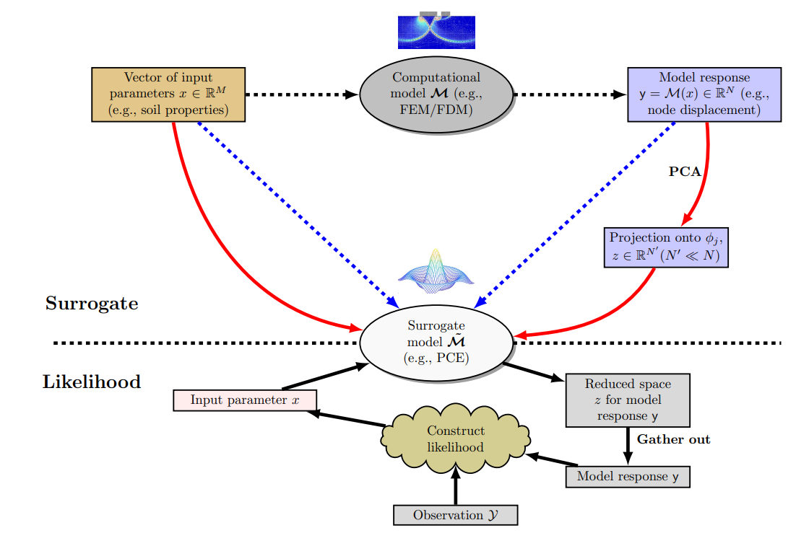

# Companion code and data for the work "Sequential Calibration of Soil Parameters Using a Two-Step Surrogate for High-Dimensional Geotechnical Outputs"

  This repository contains the MATLAB based implementation of the PCA-PCE reduced order modelling for geotechnical correlated high-dimensional outputs and uncertainty quantification. 
  
  Please cite this work, in case you use and/or refer to the PCA-PCE UQ and sequential Bayesian calibration worke.

--------------------
# Table of Contents
<!-- TOC depthFrom:2 depthTo:4 withLinks:1 updateOnSave:1 orderedList:0 -->
- [Overview](#Overview)
- [System Requirements](#Requirements)
- [Instructions](#Instructions)
- [Contact](#Contact)
<!-- /TOC -->
---------------------
# Overview 
This code is a companion to an academic research paper. If you use this work in an academic context, please cite the following publication(s):

  @article{yang2024two,
    title={A two-step surrogate method for sequential uncertainty quantification in high-dimensional inverse problems},
    author={Yang, Ningxin and Le, Truong and Potts, David M and others},
    journal={arXiv preprint arXiv:2407.11600},
    year={2024}
  }

**Keywords:** Sequential Bayesian inversion; Soil parameters; Surrogate modelling; Dimensionality reduction; High dimensions

This folder contains code and data to reproduce the results in the associated paper. In particular, the provided scripts will reproduce all graphs related to Table 3 and global sensitivity analysis results.

Open main.mlx file
## step 1
change your folder to `...\SBI\RUN`;

add your UQlab package path `...\UQlab\UQLab_Rel2.0.0\UQLab_Rel2.0.0\core`;

add your subroutine code path `...\SBI\Main\subroutines`;

Run Matlab;

## step 2
Cases A, B, C and D refers to the usage of DR and the number of training numbers.

Here, we can control the code switch:`AnParam.DR` and `AnParam.TrainDataPerc` to reproduce the results.

e.g., `AnParam.TrainDataPerc = 1` (FE training run number = 138)

  `AnParam.TestDataRun = 5; %Test FE runs number`

  `AnParam.TrainDataPerc = 1;`

## step 3
Run

---------------------
# Requirements 
The following functions used in the scripts require toolboxes to be installed:
1. UQLab packages for MCMC https://www.uqlab.com/
2. Matlab 2024
3. Statistics and Machine learning toolbox;Optimization toolbox;Global Optimization toolbox

---------------------
## Contact 
Ningxin Yang
n.yang23@imperial.ac.uk